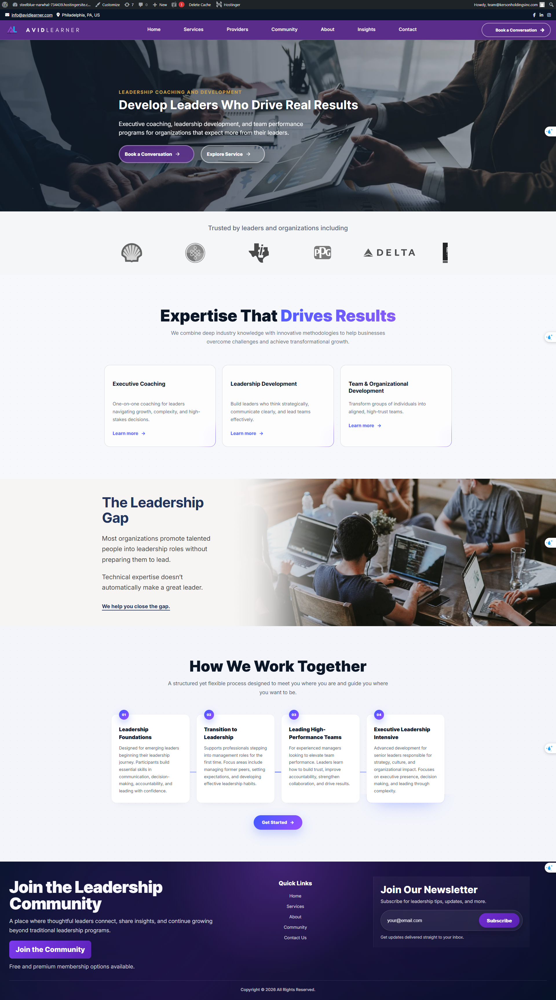

# 🎓 Avid Learner V2 — WordPress Theme & Plugin

A professional custom-built WordPress theme and plugin designed for leadership coaching, executive development, and organizational growth platforms.

---

# 📸 Preview



---

# 📌 Project Overview

**Avid Learner V2** is a modern responsive WordPress project built for leadership development and coaching businesses.

The design focuses on:

* Clean UI/UX
* Professional layout
* Responsive design
* Modular WordPress structure
* Performance-friendly architecture

---

# ✨ Features

* Custom WordPress Theme
* Custom WordPress Plugin
* Responsive Design
* Leadership Coaching Layout
* Services Section
* Team Development Workflow
* Newsletter Section
* Community Section
* Modern Hero Section
* Optimized Performance

---

# 📂 Project Structure

```bash
Avid-Learner-V2/
├── themes/
│   └── avid-learner-theme/
│       ├── assets/
│       │   └── screenshot.png
│       ├── style.css
│       ├── functions.php
│       ├── header.php
│       ├── footer.php
│       └── index.php
│
├── plugins/
│   └── avid-learner-plugin/
│       ├── avid-learner-plugin.php
│
├── README.md
├── .gitignore
└── LICENSE
```

---

# ⚙️ Installation

## Install Theme

1. Download repository:

```bash
git clone https://github.com/Nghiahadev/Avid-Learner-V2.git
```

2. Copy theme folder:

```bash
themes/avid-learner-theme
```

3. Upload to:

```bash
wp-content/themes/
```

4. Activate in:

```text
WordPress Admin → Appearance → Themes
```

---

## Install Plugin

1. Copy plugin folder:

```bash
plugins/avid-learner-plugin
```

2. Upload to:

```bash
wp-content/plugins/
```

3. Activate in:

```text
WordPress Admin → Plugins
```

---

# 🛠️ Technologies Used

* WordPress
* PHP
* HTML5
* CSS3
* JavaScript
* Bootstrap / Tailwind (update if used)

---

# 📱 Responsive Design

This theme supports:

* Desktop
* Tablet
* Mobile Devices

Built using modern responsive techniques.

---

# 🧩 Plugin Features

The custom plugin adds extended functionality to support the theme.

Possible features include:

* Custom functionality support
* Theme enhancements
* Modular plugin architecture

(Update this section with your real plugin features.)

---

# 🚀 Future Improvements

* Add Custom Post Types (CPT)
* Add Gutenberg Blocks
* Improve SEO Optimization
* Add Theme Options Panel
* Accessibility Improvements

---

# 👤 Author

**Nghia Ha**
WordPress Developer

GitHub:
https://github.com/Nghiahadev

---

# 📄 License

This project is licensed under the MIT License.

---

# ⭐ Support

If you like this project:

⭐ Star this repository
🍴 Fork it
🛠️ Contribute improvements
